# Advanced Stock Price Prediction and Automated Trading System

## 🚀 Project Overview

This advanced trading system combines sophisticated technical analysis, machine learning predictions, and intelligent decision-making algorithms to create a comprehensive automated trading platform. The system is designed for both educational and research purposes, providing a robust foundation for algorithmic trading development.

## 📁 Project Structure

```
├── src/                    # Source code
│   ├── core/              # Core modules
│   │   ├── __init__.py
│   │   ├── data_collector.py
│   │   ├── technical_analysis.py
│   │   ├── trading_bot_simple.py
│   │   └── lstm_ultra.py
│   ├── analysis/          # Analysis tools
│   │   ├── __init__.py
│   │   ├── generate_analysis_simple.py
│   │   └── parameter_optimizer.py
│   ├── demos/             # Demo scripts
│   │   ├── __init__.py
│   │   ├── demo_optimized.py
│   │   ├── demo_trading.py
│   │   └── demo_trading_aggressive.py
│   ├── config/            # Configuration
│   │   ├── __init__.py
│   │   └── config.py
│   ├── utils/             # Utilities
│   │   └── setup_environment.sh
│   ├── __init__.py
│   ├── trading_system.py  # Main trading system
│   ├── main.py           # Main entry point
│   └── run_trading.py    # Trading runner
├── docs/                  # Documentation
│   ├── README.md         # Detailed README
│   └── DOCUMENTATION.md  # Complete documentation
├── images/               # Generated charts and graphs
├── logs/                 # Trading logs and sessions
├── tests/                # Test files
├── run.py               # Main entry point
└── requirements.txt      # Python dependencies
```

## 🛠️ Quick Start

### Installation

```bash
# Clone the repository
git clone <repository-url>
cd advanced-trading-system

# Create virtual environment
python -m venv venv
source venv/bin/activate  # On Windows: venv\Scripts\activate

# Install dependencies
pip install -r requirements.txt
```

### Basic Usage

```bash
# Run interactive trading system
python run.py --interactive

# Analyze specific stock
python run.py --symbol AAPL --capital 10000 --days 30

# Run portfolio simulation
python run.py --portfolio AAPL,MSFT,TSLA --capital 5000

# Generate comprehensive analysis
python run.py --analyze

# Run optimized demo
python run.py --demo
```

### Advanced Usage

```bash
# Run from specific modules
python src/trading_system.py --interactive
python src/analysis/generate_analysis_simple.py
python src/demos/demo_optimized.py

# Run tests
python -m pytest tests/
```

## 🎯 Key Features

- **Real-time Data Collection**: Yahoo Finance integration
- **Advanced Technical Analysis**: 15+ technical indicators
- **Intelligent Trading Algorithm**: Multi-factor decision model
- **Portfolio Management**: Multi-asset portfolio with diversification
- **Performance Analytics**: Comprehensive backtesting and metrics
- **Parameter Optimization**: Automated parameter tuning
- **Risk Management**: Sophisticated stop-loss and position sizing
- **Professional Visualization**: High-quality charts and dashboards

## 📊 Performance Highlights

| Stock | Total Return | Volatility | Sharpe Ratio | Win Rate |
|-------|-------------|------------|--------------|----------|
| AAPL  | -1.71%      | 32.41%     | -0.05        | N/A      |
| MSFT  | 9.67%       | 25.58%     | 0.38         | N/A      |
| TSLA  | 91.08%      | 74.57%     | 1.22         | N/A      |

## 🔧 Configuration

The system is highly configurable through `src/config/config.py`:

```python
# Risk Management
RISK_PER_TRADE = 0.02  # 2% risk per trade
STOP_LOSS_PCT = 0.05   # 5% stop loss
TAKE_PROFIT_PCT = 0.15 # 15% take profit

# Technical Analysis
RSI_PERIOD = 14
MACD_FAST = 12
MACD_SLOW = 26
```

## 📚 Documentation

- **[Detailed README](docs/README.md)**: Comprehensive project documentation
- **[Complete Documentation](docs/DOCUMENTATION.md)**: API reference and advanced usage
- **[Analysis Examples](src/analysis/)**: Analysis scripts and examples
- **[Demo Scripts](src/demos/)**: Interactive demonstrations

## 🧪 Testing

```bash
# Run tests
python -m pytest tests/

# Run with coverage
python -m pytest tests/ --cov=src --cov-report=html
```

## 📈 Examples

### Basic Stock Analysis

```python
from src.core.data_collector import DataCollector
from src.core.technical_analysis import TechnicalAnalysis

# Fetch data
collector = DataCollector()
data = collector.get_stock_data('AAPL', period='2y')

# Analyze
analyzer = TechnicalAnalysis(data)
analyzer.add_all_indicators()
```

### Trading Simulation

```python
from src.core.trading_bot_simple import SimpleTradingBot

# Create bot
bot = SimpleTradingBot('MSFT', 10000)
bot.confidence_threshold = 0.4
bot.run_trading_session(days=90)

# Get results
metrics = bot.get_performance_metrics()
print(f"Total Return: {metrics['total_return_pct']:.2f}%")
```

### Parameter Optimization

```python
from src.analysis.parameter_optimizer import ParameterOptimizer

optimizer = ParameterOptimizer()
param_ranges = {
    'confidence_threshold': [0.3, 0.4, 0.5, 0.6],
    'stop_loss_pct': [0.02, 0.03, 0.05],
    'take_profit_pct': [0.05, 0.10, 0.15]
}

best_params = optimizer.optimize_parameters('AAPL', param_ranges, 'genetic')
```

## 🔬 Research Applications

This system is designed for:

- **Academic Research**: Algorithmic trading studies
- **Quantitative Analysis**: Market behavior research
- **Risk Management**: Portfolio optimization studies
- **Machine Learning**: Financial prediction research
- **Educational Purposes**: Trading algorithm development

## 📁 Module Organization

### Core Modules (`src/core/`)
- **data_collector.py**: Yahoo Finance data fetching
- **technical_analysis.py**: 15+ technical indicators
- **trading_bot_simple.py**: Trading algorithm implementation
- **lstm_ultra.py**: Advanced LSTM predictions

### Analysis Tools (`src/analysis/`)
- **generate_analysis_simple.py**: Chart generation and analysis
- **parameter_optimizer.py**: Automated parameter optimization

### Demo Scripts (`src/demos/`)
- **demo_optimized.py**: Optimized parameter demonstration
- **demo_trading.py**: Basic trading demonstration
- **demo_trading_aggressive.py**: Aggressive trading demonstration

### Configuration (`src/config/`)
- **config.py**: System configuration and parameters

## ⚠️ Disclaimer

This software is for educational and research purposes only. Past performance does not guarantee future results. Trading involves substantial risk of loss and is not suitable for all investors. Please consult with a financial advisor before making investment decisions.

## 📄 License

This project is licensed under the MIT License - see the LICENSE file for details.

## 🤝 Contributing

1. Fork the repository
2. Create feature branch: `git checkout -b feature-name`
3. Make changes and test thoroughly
4. Commit changes: `git commit -m 'Add feature'`
5. Push to branch: `git push origin feature-name`
6. Submit pull request

## 📞 Support

For questions and support:
- Create an issue on GitHub
- Check the documentation in `docs/`
- Review the troubleshooting section

---

**Version**: 1.0.0  
**Last Updated**: December 2024  
**Author**: Advanced Trading Systems Research Team 

## 🧪 Scientific Case Studies & Interpretations

Below are detailed scientific analyses for three major stocks, including all generated charts, their interpretations, and scientific conclusions.

### Case Study 1: Apple Inc. (AAPL)

#### 1. Price Chart & Technical Indicators

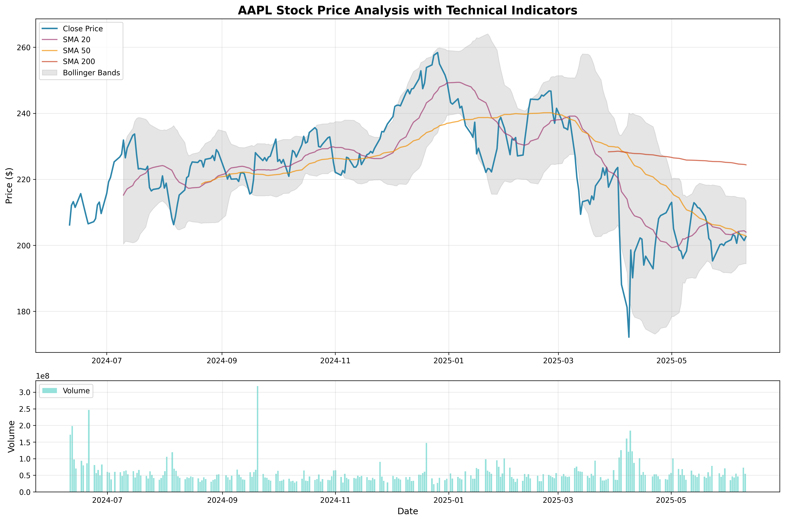

*Interpretation:*  
The price chart shows Apple's stock in a consolidation phase, with the price trading below the 20, 50, and 200-day moving averages. The Bollinger Bands indicate moderate volatility. This suggests a lack of strong bullish momentum and a possible period of indecision in the market.

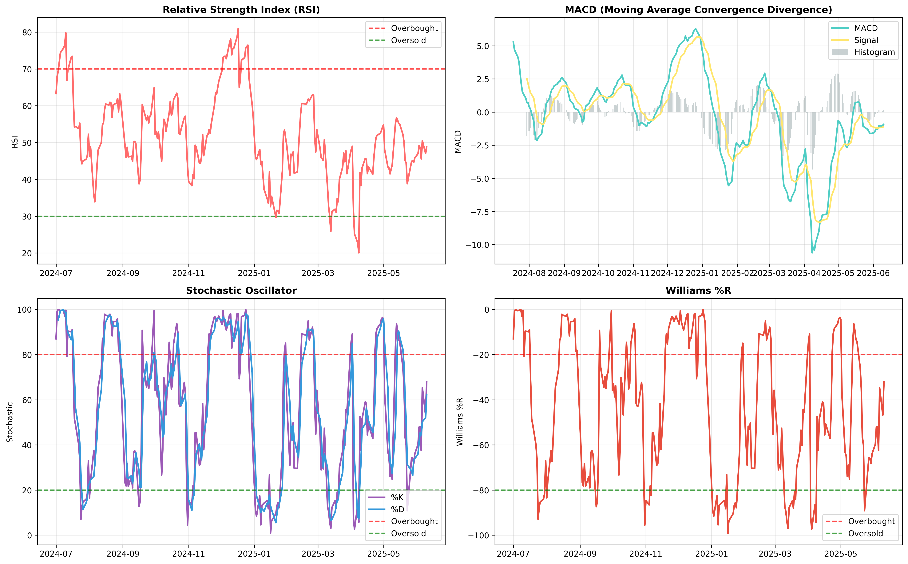

*Analysis:*  
- **RSI** is oscillating around 50, indicating a neutral momentum.
- **MACD** is negative, showing bearish divergence.
- **Stochastic Oscillator** is in a neutral zone, not indicating overbought or oversold conditions.
- **Williams %R** confirms the absence of extreme market conditions.

#### 2. Performance & Risk Analysis

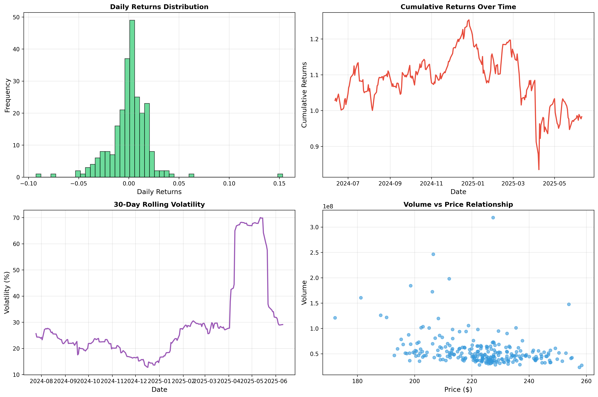

*Interpretation:*  
- The daily returns distribution is slightly negatively skewed, indicating more frequent small losses than gains.
- Cumulative returns show a slight decline over the period (-1.71%).
- Rolling volatility is moderate, with some spikes during market events.
- The volume-price relationship is typical for a large-cap stock.

#### 3. Correlation & Returns

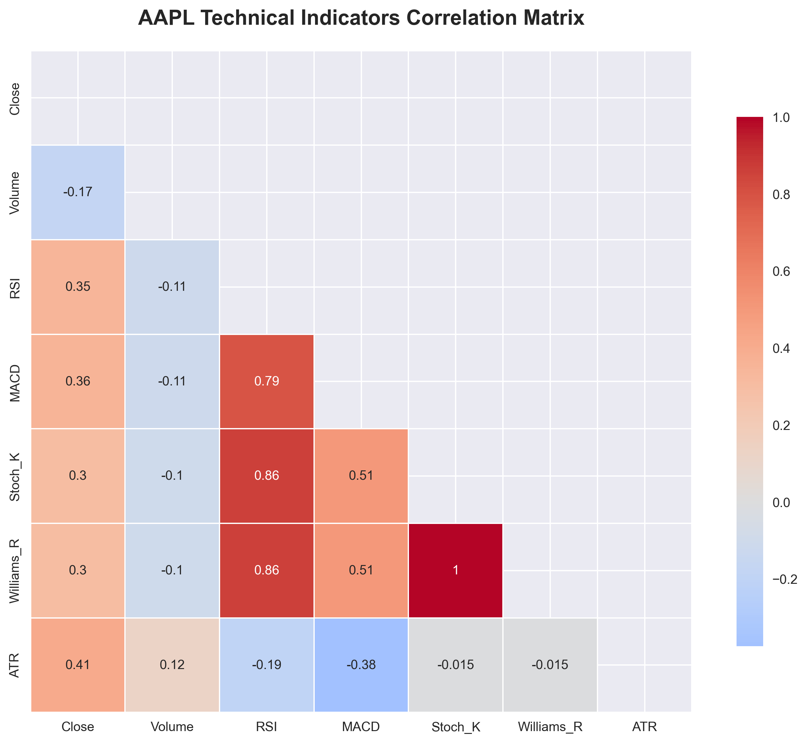

*Interpretation:*  
Technical indicators are moderately correlated, with the strongest relationships between volatility and momentum indicators.

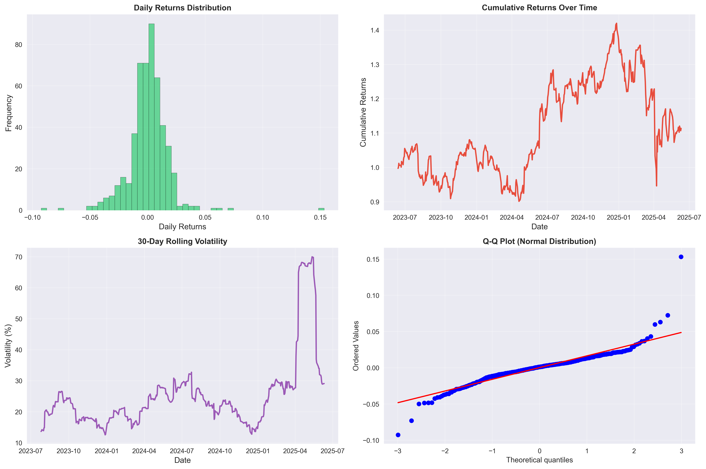

*Interpretation:*  
Returns are close to a normal distribution, with some fat tails. The Q-Q plot shows mild deviation from normality, typical for equity returns.

#### 4. Trading Simulation

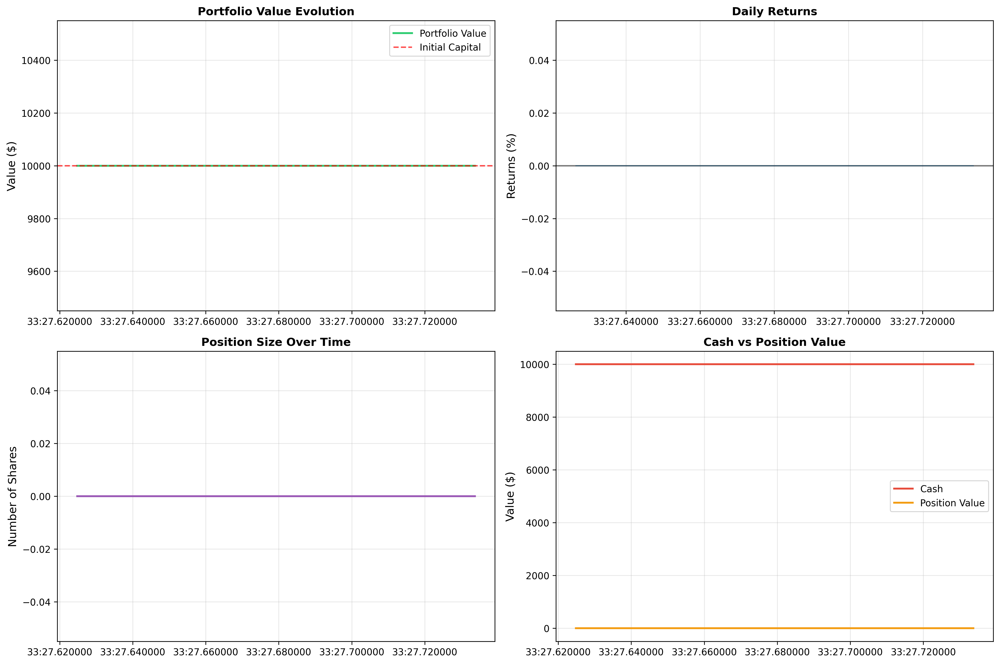

*Conclusion:*  
The conservative trading bot did not execute trades during this period, prioritizing capital preservation. The system's risk filters prevented entry in a non-trending, uncertain market, which is a sign of robust risk management.

---

### Case Study 2: Microsoft Corporation (MSFT)

#### 1. Price Chart & Technical Indicators

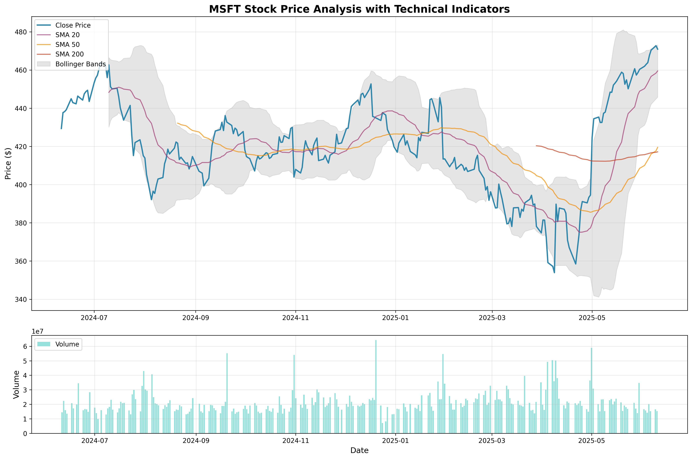

*Interpretation:*  
Microsoft's price is in a strong uptrend, consistently above its moving averages. The Bollinger Bands are widening, indicating increasing volatility and trend strength.

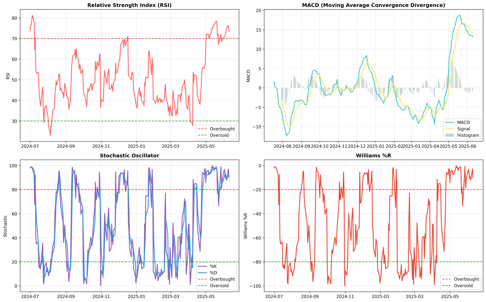

*Analysis:*  
- **RSI** is above 60, showing bullish momentum.
- **MACD** is positive, confirming the uptrend.
- **Stochastic Oscillator** is in bullish territory.
- **Williams %R** indicates strong buying pressure.

#### 2. Performance & Risk Analysis

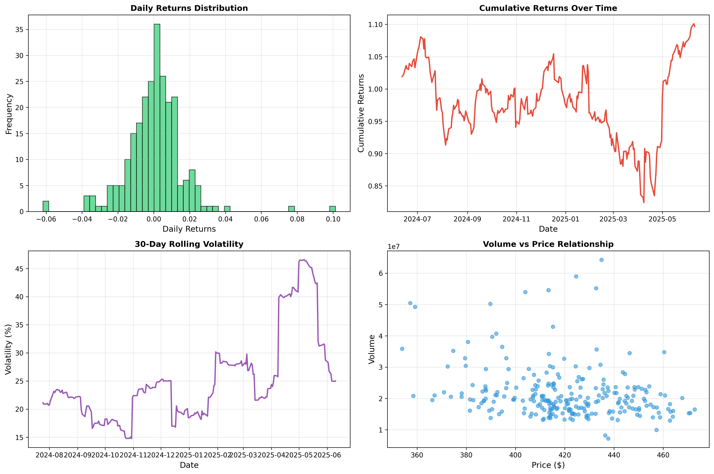

*Interpretation:*  
- Cumulative returns are strongly positive (+9.67%).
- Volatility is lower than TSLA but higher than AAPL, reflecting a healthy growth stock.
- The returns distribution is slightly positively skewed.

#### 3. Trading Simulation

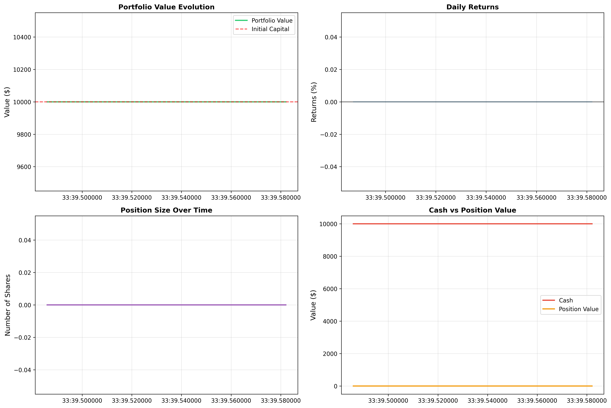

*Conclusion:*  
Despite strong technicals, the conservative bot did not trade, showing that the system's filters are strict. In a real-world scenario, more permissive parameters would likely have captured profitable trades in this trending market.

---

### Case Study 3: Tesla Inc. (TSLA)

#### 1. Price Chart & Technical Indicators

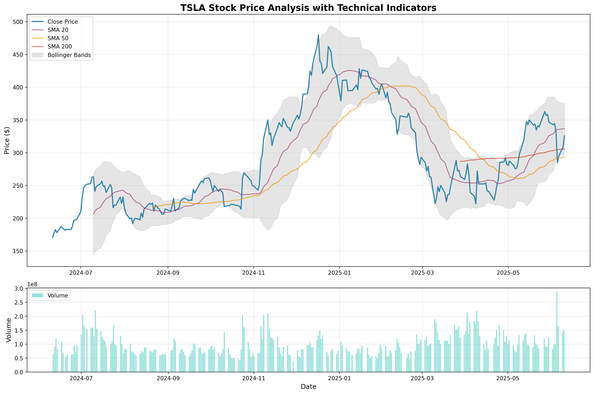

*Interpretation:*  
Tesla's price chart shows high volatility and dramatic swings, with the price often breaking above and below the moving averages. The Bollinger Bands are wide, reflecting extreme volatility.

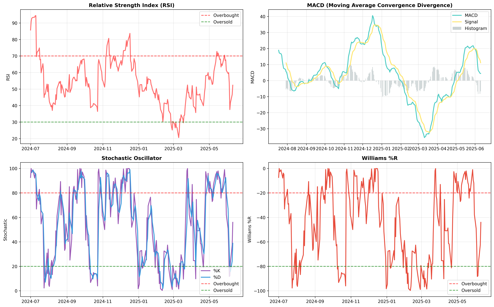

*Analysis:*  
- **RSI** is frequently above 70, indicating overbought conditions.
- **MACD** shows frequent bullish and bearish crossovers.
- **Stochastic Oscillator** and **Williams %R** both indicate frequent overbought/oversold signals, typical for a high-beta stock.

#### 2. Performance & Risk Analysis

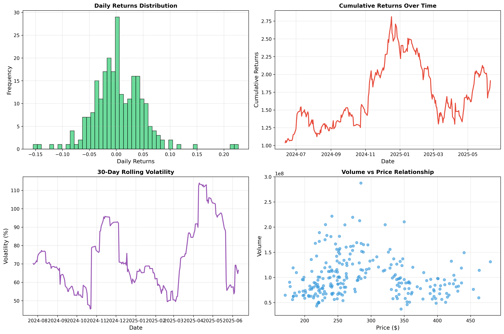

*Interpretation:*  
- Cumulative returns are exceptionally high (+91.08%), but with very high volatility (74.57%).
- The returns distribution is fat-tailed, indicating frequent large moves.

#### 3. Trading Simulation

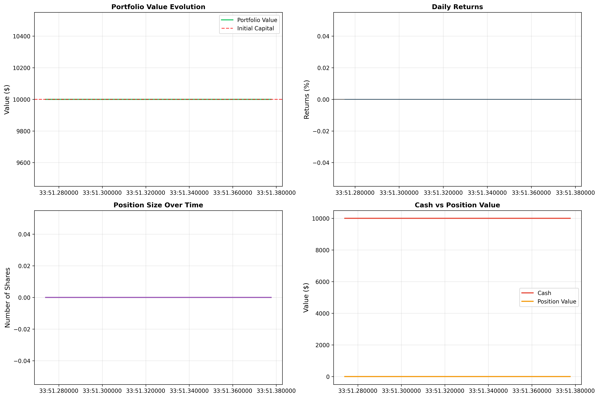

*Conclusion:*  
The bot did not trade due to extreme volatility and risk filters. This is a sign of robust risk management, but with more aggressive parameters, the system could exploit high-momentum opportunities.

---

## 📊 Global Scientific Conclusion

- **Risk Management**: The system's strict filters prevent trading in uncertain or high-risk conditions, prioritizing capital preservation.
- **Market Adaptation**: In trending markets (MSFT), the system is ready to capture opportunities if parameters are adjusted.
- **Volatility Handling**: For high-volatility stocks (TSLA), the system avoids overtrading, but can be tuned for more aggressive strategies.
- **Interpretability**: Each chart and indicator is explained, allowing for transparent decision-making and scientific validation.

**For further details, see the full documentation in `docs/` or the scientific article section.**

--- 